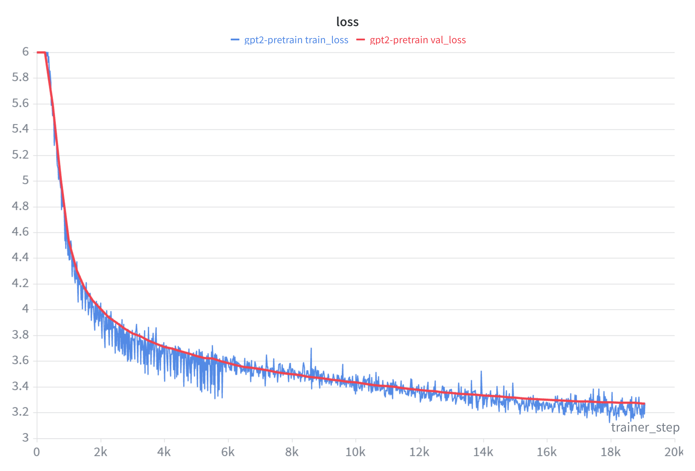
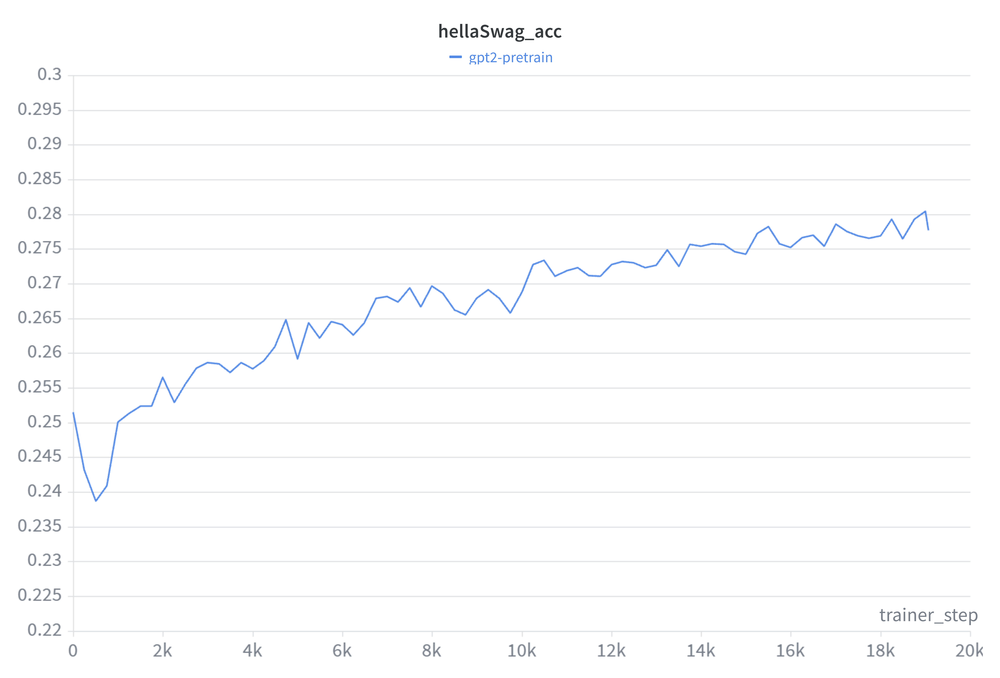

# Implementing and training GPT-2 124M from Scratch

This repositry contains a re-implementation of the GPT-2 (124M) model from OpenAI introduced in 2019.

The project is inspired by Andrej Karpathy's [nanoGPT](https://github.com/karpathy/build-nanogpt) and his [video walkthrough](https://www.youtube.com/watch?v=l8pRSuU81PU).

## Training Summary

- Model: GPT-2 124M (`12` layers, `12` heads, `768` embedding dim, context length `1024`)
- Pretraining data: FineWebEdu (`sample-10BT`) tokenized with GPT-2 BPE
- Total training tokens: `~10B`
- Hardware used: `4 x RTX 4090`
- Approximate training cost: **~$15**

## Results

<p align="center">
  
  
</p>

## Implementation Details

### Model (`gpt2.py`)

- Implements GPT-2 style architecture:
  - Token embeddings + positional embeddings
  - Stacked Transformer blocks (pre-LN)
  - Causal self-attention (supports PyTorch Flash Attention path via `scaled_dot_product_attention`)
  - MLP with GELU (`approximate='tanh'`)
  - Weight tying between token embedding and LM head
- Optimizer configuration:
  - AdamW with decayed/non-decayed parameter groups
  - `betas=(0.9, 0.95)`, `eps=1e-8`
  - Uses fused AdamW automatically when available on CUDA.

### Training (`pre_train.py`)

- Distributed training via PyTorch DDP (`nccl` backend).
- Mixed precision with `torch.autocast(..., dtype=torch.bfloat16)`.
- Gradient accumulation used to reach large effective batch size.
- Cosine LR decay with linear warmup.
- Gradient clipping at `1.0`.
- Periodic:
  - Validation loss measurement
  - HellaSwag evaluation
  - Checkpoint saving into `log/`
- Optional experiment tracking through Weights & Biases (`wandb`).

## Dataset Pipeline

### FineWebEdu pretraining shards (`data/fineweb.py`)

- Source: `HuggingFaceFW/fineweb-edu`, config `sample-10BT`, streaming mode
- Tokenizer: `tiktoken` GPT-2 encoding
- Each document is prefixed with `<|endoftext|>`
- Tokens stored as `uint16`
- Shards written to `data/edu_fineweb10B/` with target shard size `1e8` tokens
- First shard is validation (`val`), remaining shards are training (`train`)

To generate training data shards, run:

```bash
python data/fineweb.py
```

### HellaSwag evaluation set (`data/hellaswag.py`)

- Downloads official jsonl files from the public HellaSwag repository.
- Builds 4-way multiple-choice completion candidates.
- Computes normalized completion loss and reports accuracy.
- Used from `pre_train.py` during periodic evaluation.

## Running Pre-training

Install dependencies:

```bash
mamba create -n ml_prac python=3.11 -y
mamba run -n ml_prac pip install -r requirements.txt
```

Single-process run:

```bash
python pre_train.py
```

Multi-GPU DDP run (4 GPUs):

```bash
torchrun --standalone --nproc_per_node=4 pre_train.py
```

## Checkpoints and Logs

- Logs are written to `log/log.txt`
- Checkpoints are periodically written as:
  - `log/gpt2_04000.pt`
  - `log/gpt2_08000.pt`
  - ...
  - Final checkpoint near last step

## Acknowledgements

Can't thank Andrej Karpathy enough for the amazing tutorial series and nanoGPT walkthrough. It was super helpful to understand the specifics involved in building and training LLMs.
